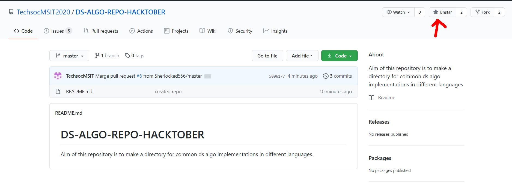
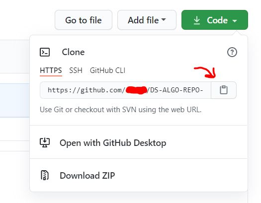
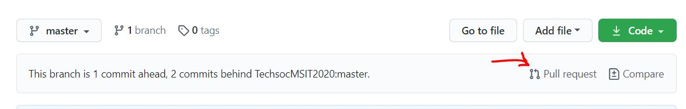

# DS-ALGO-REPO-HACKTOBER
  
<b>Aim of this repository is to make a directory for common ds algo implementations in different languages.
        </b>

---

 

    <a href="https://hacktoberfest.digitalocean.com/">
            </img>
</a>
    <a href="https://github.com/TechsocMSIT2020/DS-ALGO-REPO-HACKTOBERfork">
            </img>
        </a>   
    

  Built with ❤︎ by
  <a href="https://www.instagram.com/techsoc_msit/">TechSocMSIT</a> and
  <a href="https://github.com/TechsocMSIT2020/DS-ALGO-REPO-HACKTOBER/graphs/contributors">
    contributors
  </a>

***  
  
  
<b>Read the instructions below  and make pull requests to win a tshirt from DigitalOcean. Pull requests coming from Hacktoberfest Meetup Nepal will also qualify for free host giveaway. 
        </b>

---

# ❓ What's Hacktoberfest 2020?

Hacktoberfest is the easiest way to get into open source! Hacktoberfest is a month long festival of open source code presented by [Digital Ocean](https://www.digitalocean.com/) and [DEV](https://www.dev.to/) this year in 2020.

During the entire month of October 2020, all you have to do is contribute to any open source projects and open at least 4 pull requests. Yes, any project and any kind of contributions. It can be a be a bug fix, improvement, or even a documentation change! And win a T-Shirt and awesome stickers.

If you’ve never contributed to open source before, this is the perfect time to get started because Hacktoberfest provides a large list of available contribution opportunities (and yes, there are always plenty for beginners too).

---

# 👕 Why Should I Contribute?

Hacktoberfest has a simple and plain moto.

> Support open source and earn a limited edition T-shirt!

So, yes! You can win a T-Shirt and few awesome stickers to attach on your laptop. On plus side, you will get into beautiful world of open source and get the international exposure.  

---

# 👍 This is Awesome! How Can I Contribute?

It's very easy. You don't need to be an expert in coding and programming. Here are the steps you need to follow to create your -(maybe)- EXAMPLE first pull request within few minutes.

1. **Star this repository and Follow me on Github [here](https://github.com/TechsocMSIT2020/).**
   
2. **Fork the repository and clone it on your local machine**
   
3. **Add your files by pushing them in your forked repository**
4. **Create a new pull request.**
   
5. **Wait for your Pull Request to be reviewed and merged!**
6. **Enjoy and welcome to Hacktoberfest 2020 and Keep Contributing :)**
